

# Universidad Peruana de Ciencias Aplicadas

## *Ingeniería de Software*
**Quinto Ciclo**

**Desarrollo de Aplicaciones Open Source**

**Sección:** WS52

**Profesor:** Elio Jefferrson Navarrete Vilca

---

## Informe de TB1

**Startup:** Eventec

**Producto:** MyEvent

**Relación de Integrantes:**

[Nombre del Integrante 1]

Michael Stefano Carmelino Dueñas - U202212760

[Nombre del Integrante 3]

[Nombre del Integrante 4]

Luis Alejandro Zárate Gamarra  - U20181H198

**Abril - 2024** 

<h2>Registro de versiones del informe</h2>

<table style="width: 100%;">
    <tr>
        <th>Versión</th>
        <th>Fecha</th>
        <th>Autor</th>
        <th>Descripción de la modificación</th>
    </tr>
    <tr>
        <td><strong>TB1</strong></td>
        <td>10 de abril de 2024</td></td>
        <td>
            <ul>
                <li></li>
                <li>Michael Stefano Carmelino Dueñas</li>
                <li></li>
                <li></li>
                <li>Luis Alejandro Zárate Gamarra</li>
            </ul>
        </td>
        <td>Se formuló una solución para abordar la oportunidad identificada y se procedió a desarrollar los primeros cinco capítulos del proyecto, desde la Introducción hasta la Implementación del Producto, Validación y Despliegue. De esta manera, hemos completado la fase inicial del proyecto según la estructura indicada en este informe.</td>
    </tr>
</table>

<h1 style="color: red;">STUDENT OUTCOME</h1>

<table style="width: 100%;">
    <tr>
        <th>Criterios específicos</th>
        <th>Acciones realizadas</th>
        <th>Conclusiones</th>
    </tr>
    <tr>
        <td><strong>Comunica oralmente con efectividad a
        diferentes rangos de audiencia</strong></td>
        <td>
            <ul style="list-style-type: none;">
                <li><strong>1</strong></li>
                <li><strong>Michael Stefano Carmelino Dueñas</strong></li>
                

                    <strong>TB1</strong>
                    

                    Desarrollo e implementación de:

                    
Entrevista a cada uno de los segmentos objetivos

                    
To-Be Scenario Mapping

                    
 User Stories

                    
 Product Backlog

                    
Programación de la Landing Page
                    

                  

                <li><strong>3</strong></li>
                <li><strong>4</strong></li>
                <li><strong>Luis Alejandro Zárate Gamarra</strong>
                  

                    <strong>TB1</strong>
                    

                      Desarrollo e implementación de los capítulos 2 y 3...
                    

                  

                </li>    
            </ul>
                </li>    
            </ul>
        </td>
        <td>
          

            <strong>TB1</strong>
              

                Se analizó una problemática que afecta a dos segmentos
              

          

        </td>
    </tr>
</table>

# Tabla de Contenido

- [Registro de Versiones](#registro-de-versiones)
- [Project Report Collaboration Insights](#project-report-collaboration-insights)
- [Student Outcome](#student-outcome)
- [Capítulo I: Introducción](#Capítulo-I-Introducción)
  - [1.1. Startup Profile](#11-startup-profile)
    - [1.1.1. Descripción de la Startup](#111-descripción-de-la-startup)
    - [1.1.2. Perfiles de integrantes del equipo](#112-perfiles-de-integrantes-del-equipo)
  - [1.2. Solution Profile](#12-solution-profile)
    - [1.2.1. Antecedentes y problemática](#121-antecedentes-y-problemática)
    - [1.2.2. Lean UX Process](#122-lean-ux-process)
      - [1.2.2.1. Lean UX Problem Statements](#1221-lean-ux-problem-statements)
      - [1.2.2.2. Lean UX Assumptions](#1222-lean-ux-assumptions)
      - [1.2.2.3. Lean UX Hypothesis Statements](#1223-lean-ux-hypothesis-statements)
      - [1.2.2.4. Lean UX Canvas](#1224-lean-ux-canvas)
  - [1.3. Segmentos objetivo](#13-segmentos-objetivo)
- [Capítulo II: Requirements Elicitation & Analysis](#Capítulo-II-Requirements-Elicitation--Analysis)
  - [2.1. Competidores](#21-competidores)
    - [2.1.1. Análisis competitivo](#211-análisis-competitivo)
    - [2.1.2. Estrategias y tácticas frente a competidores](#212-estrategias-y-tácticas-frente-a-competidores)
  - [2.2. Entrevistas](#22-entrevistas)
    - [2.2.1. Diseño de entrevistas](#221-diseño-de-entrevistas)
    - [2.2.2. Registro de entrevistas](#222-registro-de-entrevistas)
    - [2.2.3. Análisis de entrevistas](#223-análisis-de-entrevistas)
  - [2.3. Needfinding](#23-needfinding)
    - [2.3.1. User Personas](#231-user-personas)
    - [2.3.2. User Task Matrix](#232-user-task-matrix)
    - [2.3.3. User Journey Mapping](#233-user-journey-mapping)
    - [2.3.4. Empathy Mapping](#234-empathy-mapping)
    - [2.3.5. As-is Scenario Mapping](#235-as-is-scenario-mapping)
  - [2.4. Ubiquitous Language](#23-ubiquitous-language)
- [Capítulo III: Requirements Specification](#Capítulo-III-Requirements-Specification)
  - [3.1. To-Be Scenario Mapping](#31-to-be-scenario-mapping)
  - [3.2. User Stories](#32-user-stories)
  - [3.3. Impact Mapping](#33-impact-mapping)
  - [3.4. Product Backlog](#34-product-backlog)
- [Capítulo IV: Product Design](#Capítulo-IV-Product-Design)
  - [4.1. Style Guidelines](#41-style-guidelines)
    - [4.1.1. General Style Guidelines](#411-general-style-guidelines)
    - [4.1.2. Web Style Guidelines](#412-web-style-guidelines)
  - [4.2. Information Architecture](#42-information-architecture)
    - [4.2.1. Organization Systems](#421-organization-systems)
    - [4.2.2. Labeling Systems](#422-labeling-systems)
    - [4.2.3. SEO Tags and Meta Tags](#423-seo-tags-and-meta-tags)
    - [4.2.4. Searching Systems](#424-searching-systems)
    - [4.2.5. Navigation Systems](#425-navigation-systems)
  - [4.3. Landing Page UI Design](#43-landing-page-ui-design)
    - [4.3.1. Landing Page Wireframe](#431-landing-page-wireframe)
    - [4.3.2. Landing Page Mock-up](#432-landing-page-mock-up)
  - [4.4. Web Applications UX/UI Design](#44-web-applications-uxui-design)
    - [4.4.1. Web Applications Wireframes](#441-web-applications-wireframes)
    - [4.4.2. Web Applications Wireflow Diagrams](#442-web-applications-wireflow-diagrams)
    - [4.4.3. Web Applications Mock-ups](#443-web-applications-mock-ups)
    - [4.4.4. Web Applications User Flow Diagrams](#444-web-applications-user-flow-diagrams)
  - [4.5. Web Applications Prototyping](#45-web-applications-prototyping)
  - [4.6. Domain-Driven Software Architecture](#46-domain-driven-software-architecture)
    - [4.6.1. Software Architecture Context Diagram](#461-software-architecture-context-diagram)
    - [4.6.2. Software Architecture Container Diagrams](#462-software-architecture-container-diagrams)
    - [4.6.3. Software Architecture Components Diagrams](#463-software-architecture-components-diagrams)
  - [4.7. Software Object-Oriented Design](#47-software-object-oriented-design)
    - [4.7.1. Class Diagrams](#471-class-diagrams)
    - [4.7.2. Class Dictionary](#472-class-dictionary)
  - [4.8. Database Design](#48-database-design)
    - [4.8.1. Database Diagram](#481-database-diagram)
- [Capítulo V: Product Implementation, Validation & Deployment](#Capítulo-V-Product-Implementation-Validation--Deployment)
  - [5.1. Software Configuration Management](#51-software-configuration-management)
    - [5.1.1. Software Development Environment Configuration](#511-software-development-environment-configuration)
    - [5.1.2. Source Code Management](#512-source-code-management)
    - [5.1.3. Source Code Style Guide & Conventions](#513-source-code-style-guide--conventions)
    - [5.1.4. Software Deployment Configuration](#514-software-deployment-configuration)
  - [5.2. Landing Page, Services & Applications Implementation](#52-landing-page-services--applications-implementation)
    - [5.2.1. Sprint n](#521-sprint-n)
      - [5.2.1.1. Sprint Planning n](#5211-sprint-planning-n) -[5.2.1.2. Sprint Backlog n](#5212-sprint-backlog-n)
      - [5.2.1.3. Development Evidence for Sprint Review](#5213-development-evidence-for-sprint-review)
      - [5.2.1.4. Testing Suite Evidence for Sprint Review](#5214-testing-suite-evidence-for-sprint-review)
      - [5.2.1.5. Execution Evidence for Sprint Review](#5215-execution-evidence-for-sprint-review)
      - [5.2.1.6. Services Documentation Evidence for Sprint Review](#5216-services-documentation-evidence-for-sprint-review)
      - [5.2.1.7. Software Deployment Evidence for Sprint Review](#5217-software-deployment-evidence-for-sprint-review)
      - [5.2.1.8. Team Collaboration Insights during Sprint](#5218-team-collaboration-insights-during-sprint)
  - [5.3. Validation Interviews](#53-validation-interviews)
    - [5.3.1. Diseño de Entrevistas](#531-diseño-de-entrevistas)
    - [5.3.2. Registro de Entrevistas](#532-registro-de-entrevistas)
    - [5.3.3. Evaluaciones según heurísticas](#533-evaluaciones-según-heurísticas)
  - [5.4. Video About-the-Product](#54-video-about-the-product)
- [Conclusiones](#conclusiones)
  - [Conclusiones y recomendaciones](#conclusiones-y-recomendaciones)
- [Video About-the-Team](#video-about-the-team)
- [Bibliografía](#bibliografía)
- [Anexos](#anexos)

<h2>Registro de versiones del informe</h2>

<h1>CAPÍTULO I: INTRODUCCIÓN</h1>
<h2>1.1 Startup Profile</h2>
<h3>1.1.1 Descripción de la Startup</h3>

Nuestra startup ofrece una plataforma de venta de entradas centrada en usuarios y organizadores de eventos. Proporcionamos una amplia gama de eventos y funcionalidades como registro de usuarios, creación de eventos y venta de entradas. Nuestro enfoque en la satisfacción del cliente se refleja en nuestras políticas de recompensas y membresías premium. Con un modelo de negocio transparente, estamos transformando la experiencia de descubrir y participar en eventos.

<h3>1.1.2 Perfiles de integrantes del equipo</h3>

  
<strong>Alessandro Joaquin Bernardo Eusebio</strong>

  
  
Soy estudiante de la carrera de Ingeniería de software en la UPC, tengo conocimientos básicos sobre programación
  en el lenguaje de C++ y Python, conocimiento básico sobre configuración de redes y aplicación de la complejidad 
  algorítmica. Tengo además conocimientos básicos sobre ciberseguridad y fundamentos de probabilidad y sus aplicaciones
  . Siempre dispuesto a trabajar en equipo. Me considero una persona paciente y respetuosa que tiene como objetivo 
  llevar a cabo este proyecto de forma satisfactoria.

  
<strong>Michael Stefano Carmelino Dueñas</strong>

   
  
Estudio la carrera de Ingeniería de Software en la UPC, tengo conocimientos básicos en C++, Python y Java. Soy una persona que le gusta el liderazgo y organización en equipo, coordinación y poder generar un buen entorno. Ayudo a quienes lo necesiten con lo máximo que pueda. De igual forma tengo conocimientos en los que son fundamentos en Ciencia de Datos.

  
<strong>Piero Jhoynner Muñoz Salcedo</strong>

  
  
Soy estudiante de Ingeniería de Software en la UPC. Me considero una persona entusiasta y muy creativa, predispuesta a trabajar en proyectos relacionados con la tecnología. Cuento con conocimiento basico en lenguajes de programación como python y java, además de un buen nivel en HTML y CSS. Me gusta trabajar en equipo y siempre trato de mejorar como persona cada día.

  
<strong>Luis Alejandro Zárate Gamarra</strong>

  
  
Soy estudiante de Ingeniería de Software en la UPC y cuento con conocimientos intermedios en desarrollo web, administración y gestión de entornos LMS, análisis de tecnologías móviles y diseño y maquetación de entornos web. Me considero una persona responsalbe y empática, con capacidad para trabajar de forma colaborativa. Durante el transcurso de mi desarrollo me interesa cada vez más involucrar mis conocimientos en el ámbito educativo. Me gusta realizar actividades sociales y disfrutar el tiempo con amigos y familia.

  
<strong>Luis Mario Gonzales Anaya</strong>

  
  
Estudio Ingeniería de Software en la UPC. Me gusta dibujar y ayudar a los demás en lo que mi capacidad me permite, tengo experiencia en la programación y otras ramas, me gusta aprender siempre y ser alguien parcial. Estoy encantado de ser parte de este grupo y daré todo mi esfuerzo para que este proyecto demuestre un buen rendimiento.

<h2>1.2 Solution Profile</h2>
<h3>1.2.1 Antecedentes y problemática</h3>
<h4>1.2.1.1 What?</h4>

Existe una dificultad generalizada para adquirir boletos para conciertos y otros eventos debido a la falta de acceso directo a la compra, largas filas, intermediarios poco confiables y la posibilidad de adquirir entradas falsas.

<h4>1.2.1.2 When?</h4>

Esta problemática surge en momentos cercanos a la venta de entradas para eventos populares, cuando la demanda es alta y la oferta limitada. Además, se intensifica durante la etapa de preventa y venta general de boletos.

<h4>1.2.1.3 Where?</h4>

Este problema es relevante en múltiples ubicaciones donde se realizan conciertos y eventos, especialmente en áreas urbanas densamente pobladas donde la demanda es alta y la oferta de boletos puede ser limitada.

<h4>1.2.1.4 Who?</h4>

Este problema afecta a los aficionados a la música y los eventos en general, así como a los organizadores de eventos que desean facilitar la experiencia de compra de boletos para sus seguidores.

<h4>1.2.1.5 Why?</h4>

La creación de esta aplicación surge debido a la necesidad de mejorar la experiencia de compra de boletos para eventos, ofreciendo un canal confiable y directo para adquirir entradas de manera rápida y segura, evitando intermediarios poco confiables y la posibilidad de adquirir entradas falsas.

<h4>1.2.1.6 How?</h4>

Nuestra aplicación aborda esta problemática proporcionando una plataforma segura y confiable para la compra de boletos para conciertos y eventos. A través de nuestra aplicación, los usuarios pueden buscar eventos, seleccionar asientos, y realizar la compra de boletos de manera directa y segura, eliminando intermediarios no confiables y mitigando el riesgo de adquirir entradas falsas.

<h4>1.2.1.7 How much?</h4>

En la industria de eventos, se han reportado casos de revendedores que inflan los precios de los boletos varias veces por encima de su valor original, lo que dificulta el acceso a los eventos para muchos aficionados. Con nuestra aplicación, buscamos ofrecer precios justos y transparentes para los boletos, eliminando intermediarios no confiables y evitando la inflación de precios.

    
<h3>1.2.2 Lean UX Process</h3>
<h4>1.2.2.1 Lean UX Problem Statements</h4>

Dificultad para encontrar eventos relevantes:  
 Los usuarios tienen dificultades para encontrar eventos ajustados a sus intereses y preferencias dentro de una variedad de espectáculos.

Desconfianza en la autenticidad de las entradas: 
Los usuarios se preocupan por la autenticidad de las entradas compradas en línea, por ese motivo, existe desconfianza en el proceso de compra.

Acceso limitado a eventos exclusivos para revendedores: 
Los revendedores enfrentan desafíos para acceder a eventos exclusivo debido a la falta de acceso temprano, por lo cual perderían oportunidades.

Falta de opciones para usuarios empresariales: 
Los organizadores de eventos no cuentan con plataformas efectivas donde crear, gestionar y promocionar sus eventos recreativos.

Complejidad en la compra de entradas: 
 los usuarios experimentan frustraciones, esto se debe al proceso complicado que conlleva la compra de entradas, como la falta de información clara de los precios y la disponibilidad, y la seguridad en las transacciones.
 

<h4>1.2.2.2 Lean UX Assumptions</h4>

Los usuarios prefieren una experiencia de compra intuitiva:  
suponemos que los usuarios prefieren una interfaz de usuario intuitiva que les permita navegar fácilmente por los eventos, ver los detalles de los precios y la disponibilidad de entrada, además, realizar transacciones de forma rápida y segura.

Los usuarios valoran la variedad de eventos: 
Suponemos que los usuarios valoran tener acceso a una diversidad de eventos, para satisfacer sus intereses y preferencia.

Los organizadores buscan herramientas eficientes de gestión de eventos: 
Suponemos que los organizadores de eventos valoran una plataforma que les brinde herramientas eficientes para crear, gestionar y promocionar sus eventos de manera efectiva, incluyendo procesos de revisión y aprobación para garantizar la calidad de los eventos publicados.

La es seguridad en las transacciones es clave: 
Suponemos que los usuarios consideran importante la seguridad en las transacciones al comprar las entradas por medio de una página web, además de la autenticidad de las entradas y la protección de sus datos financieros.

 Ofrecer Descuentos en Compras Futuras Aumenta la Retención de Usuarios: 
Se asume que proporcionar descuentos en compras futuras de entradas para eventos ayudara a mejorar las tasas de retención de usuarios al incentivarlos a volver a la plataforma para transacciones posteriores.

Programas de Fidelización Mejoran la Experiencia del Usuario:  
Se asume que implementar un programa de fidelización con acumulación y canje de puntos va a mejorar la experiencia del usuario al ofrecer recompensas por el compromiso continuo con la plataforma.

<h4>1.2.2.3 Lean UX Hypothesis Statements</h4>

Hypothesis 1: Si se implementa un sistema de recomendación de eventos fácil de usar, adaptado a los intereses y preferencias de los usuarios, entonces los usuarios encontrarán más fácilmente descubrir eventos relevantes en medio de una variedad de espectáculos..

Hypothesis 2: Si una plataforma de compra de boletos en línea implementa medidas robustas de autenticación y garantiza la autenticidad de los boletos, entonces la confianza de los usuarios en el proceso de compra aumentará, aliviando preocupaciones sobre boletos fraudulentos.

Hypothesis 3:  Si a los revendedores se les otorga acceso anticipado a eventos exclusivos a través de una plataforma dedicada, entonces tendrán mayores oportunidades de adquirir boletos y posteriormente expandir su negocio, reduciendo la probabilidad de oportunidades perdidas.

Hypothesis 4: Si se desarrolla una plataforma efectiva específicamente para que los organizadores creen, gestionen y promocionen eventos recreativos, entonces las empresas tendrán mejores opciones para mostrar sus eventos, lo que potencialmente conducirá a una mayor participación y ingresos.

Hypothesis 5: Si se simplifica el proceso de compra de boletos con información clara sobre precios y disponibilidad, así como una seguridad de transacción mejorada, entonces los usuarios experimentarán menos frustración y mayor confianza al realizar compras de boletos, lo que en última instancia llevará a tasas de conversión más altas.

<h4>1.2.2.4 Lean UX Canvas</h4>
   
 

<h2>1.3 Segmentos objetivo</h2>

MyEvent está diseñado para atender a dos segmentos clave en la industria del entretenimiento en vivo. El primero se compone de entusiastas de la música y los eventos en vivo, que buscan una experiencia sin complicaciones al adquirir entradas para conciertos, festivales y espectáculos locales. Para este segmento se considerará la conveniencia, la variedad de eventos disponibles y la seguridad en las transacciones en línea. El segundo segmento lo conforman los organizadores de eventos y propietarios de locales. Este grupo buscan una plataforma confiable y eficiente para vender y gestionar las entradas de sus eventos. Priorizan herramientas que les permitan alcanzar a su audiencia objetivo de manera efectiva, gestionar fácilmente el proceso de venta de entradas y obtener información detallada sobre la asistencia y las preferencias de los asistentes. Al comprender las necesidades únicas de estos dos tipos de usuarios, MyEvent se posiciona como una solución integral que ofrece una experiencia fluida tanto para los compradores de entradas como para los organizadores de eventos.

<h1>CAPÍTULO II: REQUISITOS DE ELICITACIÓN Y ANÁLISIS</h1>
<h2>2.1 Competidores</h2>

En el competitivo mercado de la venta de entradas para eventos en línea, MyEvent se enfrenta a varios competidores destacados. Entre ellos, se encuentran plataformas establecidas como Teleticket, Passline y Joinnus. Teleticket, reconocida por su amplia cobertura nacional, ofrece una amplia gama de eventos culturales y de entretenimiento. Por otro lado, Passline se destaca por su interfaz fácil de usar y su enfoque en la seguridad de las transacciones. Joinnus, por su parte, se distingue por su versatilidad, no solo como plataforma de venta de entradas, sino también como organizadora y promoción de eventos. Aunque estos competidores representan una competencia sólida, MyEvent busca diferenciarse mediante características únicas, como la opción de combos exclusivos, asociaciones conn establecimientos y opciones para revendedores, para ofrecer a los usuarios una experiencia completa y emocionante al comprar entradas para eventos locales.

<h3>2.1.1 Análisis competitivo</h3>
<table>
    <tr>
        <th>¿Por qué llevar a cabo este análisis?</th>
        <th colspan="4">El análisis competitivo es fundamental para comprender el entorno en el que opera nuestro proyecto. Nos permite identificar las fortalezas, debilidades, oportunidades y amenazas de nuestros competidores, lo que a su vez nos ayuda a tomar decisiones estratégicas informadas para mejorar nuestra posición en el mercado y desarrollar ventajas competitivas.</th>        
    </tr>
  <tr>
    <th></th>
    <th>MyEvent</th>
    <th>Teleticket</th>
    <th>Passline</th>
    <th>Joinnus</th>
  </tr>
  <tr>
    <td><strong>Overview</strong></td>
    <td>MyEvent es una plataforma de venta de entradas intuitiva para usuarios y organizadores de eventos, con una amplia variedad de eventos y un enfoque en la satisfacción del cliente.</td>
    <td>Teleticket es una plataforma líder en la venta de entradas para eventos en Perú. Ofrece una amplia gama de servicios relacionados con la venta de boletos para conciertos, obras de teatro, eventos deportivos y más.</td>
    <td>Passline es una plataforma de venta de entradas que se enfoca en la facilidad de uso y la integración con redes sociales. Ofrece una experiencia de compra rápida y sencilla para los usuarios.</td>
    <td>Joinnus es una plataforma de eventos que no solo se centra en la venta de entradas, sino que también proporciona información detallada sobre eventos culturales, deportivos y de entretenimiento en Perú.</td>
  </tr>
  <tr>
    <td><strong>Ventajas Competitivas</strong></td>
    <td>Destacamos por nuestra diversidad de eventos, funcionalidades completas de plataforma y modelo de negocio transparente.</td>
    <td>Gran experiencia en el mercado local, asociaciones sólidas con organizadores de eventos, diversidad de eventos disponibles.</td>
    <td>Facilidad de uso de la plataforma, integración con redes sociales, enfoque en la experiencia del usuario.</td>
    <td>Amplia variedad de eventos, información detallada y reseñas de eventos, comunidad activa de usuarios.</td>
  </tr>
  <tr>
    <td><strong>Mercado Objetivo</strong></td>
    <td>Nuestro mercado objetivo son usuarios interesados en una variedad de eventos y organizadores que buscan una plataforma sencilla para promocionar y vender boletos.</td>
    <td>Principalmente público local interesado en una amplia gama de eventos culturales y deportivos.</td>
    <td>Usuarios que buscan una experiencia de compra rápida y sencilla, con una inclinación hacia la tecnología y las redes sociales.</td>
    <td>Personas interesadas en descubrir nuevos eventos culturales, deportivos y de entretenimiento en Perú, con una mentalidad más exploratoria.</td>
  </tr>
  <tr>
    <td><strong>Estrategias de Marketing</strong></td>
    <td>Utilizamos estrategias de marketing digital, alianzas con organizadores locales y promociones especiales para aumentar la participación de los usuarios.</td>
    <td>Campañas publicitarias locales, colaboraciones con organizadores de eventos, promociones especiales.</td>
    <td>Marketing en redes sociales, promoción de la facilidad de uso, campañas de influencer marketing.</td>
    <td>Contenido en línea relevante, colaboraciones con artistas y organizadores de eventos, estrategias de SEO.</td>
  </tr>
  <tr>
    <td><strong>Productos & Servicios</strong></td>
    <td>Ofrecemos una plataforma de venta de entradas en línea con registro de usuarios, creación de eventos y venta de boletos para diversas actividades.</td>
    <td>Venta de entradas para una amplia gama de eventos, servicios de reserva de asientos, opciones de entrega de boletos.</td>
    <td>Venta de entradas en línea, reserva de boletos, integración con redes sociales para compartir eventos.</td>
    <td>Venta de entradas, información detallada sobre eventos, reseñas de usuarios, recomendaciones personalizadas.</td>
  </tr>
  <tr>
    <td><strong>Precios & Costos</strong></td>
    <td>Nuestros precios son transparentes y competitivos, con costos operativos que incluyen mantenimiento de plataforma y marketing.</td>
    <td>Nuestros precios son transparentes y competitivos, con costos operativos que incluyen mantenimiento de plataforma, marketing y soporte al cliente.</td>
    <td>Comisiones de servicio transparentes, posibles descuentos por compras a través de la plataforma.</td>
    <td>Comisiones de servicio competitivas, posibles ofertas y promociones para usuarios frecuentes.</td>
  </tr>
  <tr>
    <td><strong>Canales de Distribución</strong></td>
    <td>Distribuimos entradas a través de nuestra plataforma en línea, asociaciones con organizadores locales y puntos de venta físicos en lugares de eventos.</td>
    <td>Venta en línea a través del sitio web, puntos de venta físicos en locales asociados.</td>
    <td>Plataforma en línea accesible desde dispositivos móviles y computadoras, integración con redes sociales.</td>
    <td>Sitio web, aplicaciones móviles para iOS y Android, redes sociales, boletines informativos.</td>
  </tr>
  <tr>
    <td><strong>Fortalezas</strong></td>
    <td>Destacamos por nuestra diversidad de eventos, funcionalidades completas de plataforma y enfoque en la satisfacción del cliente.</td>
    <td>Reconocimiento de marca, experiencia en el mercado, asociaciones estratégicas.</td>
    <td>Facilidad de uso, integración con redes sociales, enfoque en la experiencia del usuario.</td>
    <td>Amplia variedad de eventos, información detallada, comunidad activa de usuarios.</td>
  </tr>
  <tr>
    <td><strong>Debilidades</strong></td>
    <td>Necesitamos aumentar el reconocimiento de marca y fortalecer nuestras asociaciones estratégicas.</td>
    <td>Puede carecer de innovación tecnológica, posible falta de enfoque en la experiencia del usuario.</td>
    <td>Puede ser percibido como menos establecido en comparación con competidores más antiguos, posibles limitaciones en la diversidad de eventos.</td>
    <td>Menos reconocimiento de marca en comparación con competidores establecidos, posibles dificultades para atraer a usuarios más tradicionales.</td>
  </tr>
  <tr>
    <td><strong>Oportunidades</strong></td>
    <td>Vemos oportunidades en la expansión a nuevos mercados, colaboraciones con organizadores emergentes y desarrollo de nuevas características para mejorar la experiencia del usuario.</td>
    <td>Expansión a nuevos mercados, innovación tecnológica, colaboraciones estratégicas.</td>
    <td>Crecimiento en la base de usuarios a través de campañas de marketing en redes sociales, expansión internacional.</td>
    <td>Desarrollo de nuevas características en la plataforma, asociaciones con organizadores de eventos emergentes.</td>
  </tr>
</table>

<h3>2.1.2 Estrategias y tácticas frente a competidores</h3>

Considerando el rubro de eventos y los competidores en el mercado, hemos delineado las siguientes estrategias clave:

<ol>
    <li><strong>Enfoque en la diversidad de eventos:</strong> Nos centraremos en ofrecer una amplia variedad de eventos para satisfacer los diferentes gustos e intereses de nuestro público objetivo. Esto nos diferenciará de competidores que pueden tener un catálogo más limitado de eventos.</li>
    <li><strong>Promoción de eventos exclusivos:</strong> Organizaremos y promocionaremos eventos exclusivos que no estén disponibles en otras plataformas. Esto atraerá a usuarios que buscan experiencias únicas y diferenciadas.</li>
    <li><strong>Optimización para dispositivos móviles:</strong> Nos aseguraremos de que nuestra plataforma sea completamente compatible y fácil de usar en dispositivos móviles, lo que permitirá a los usuarios comprar entradas sobre la marcha. Esta facilidad de acceso puede ser una ventaja sobre competidores que pueden no tener una experiencia móvil tan fluida.</li>
    <li><strong>Colaboraciones con organizadores de eventos locales:</strong> Estableceremos relaciones sólidas con organizadores de eventos locales para ofrecer promociones especiales y acceso exclusivo a nuestros usuarios. Esto nos ayudará a fortalecer nuestra presencia en la comunidad y atraer a más usuarios a nuestra plataforma.</li>
</ol>
    
<h2>2.2 Entrevistas</h2>
<h3>2.2.1 Diseño de entrevistas</h3>
<h5>Preguntas dirigidas al segmento Organizadores de Eventos:</h5>
<ol>
    <li>¿Qué desafíos enfrentas al promocionar y vender entradas para tus eventos actualmente?</li>
    <li>¿Cómo sueles gestionar la venta de entradas para tus eventos?</li>
    <li>¿Qué funcionalidades te gustaría ver en una plataforma de venta de entradas para facilitar la organización de tus eventos?</li>
    <li>¿Qué criterios consideras al elegir una plataforma para vender tus entradas?</li>
    <li>¿Qué tipo de soporte o asistencia esperarías de una plataforma de venta de entradas?</li>
    <li>¿Qué estrategias utilizas para atraer a un público más amplio a tus eventos?</li>
    <li>¿Qué tan importante es para ti tener acceso a datos y análisis sobre la venta de entradas y la asistencia a tus eventos?</li>
    <li>¿Alguna vez te ha pasado que has vendido todas las entradas para algún evento y a la hora del show no estaba lleno? y si pasó eso. ¿Cómo te sentiste?</li>
    <li>¿Cómo te sientes acerca de compartir información sobre tus eventos en una plataforma online?</li>
    <li>¿Qué medidas de seguridad y privacidad consideras esenciales al utilizar una plataforma de venta de entradas para tus eventos?</li>
</ol>

<h5>Preguntas dirigidas al segmento Compradores de Entradas:</h5>
<ol>
    <li>¿Con qué frecuencia asistes a eventos como conciertos, festivales o espectáculos en vivo?</li>
    <li>¿Qué te motiva a comprar entradas para un evento en particular?</li>
    <li>¿Qué aspectos consideras más importantes al elegir dónde comprar tus entradas?</li>
    <li>¿Has tenido alguna experiencia negativa al comprar entradas para eventos en el pasado?</li>
    <li>¿Qué funcionalidades te gustaría ver en una plataforma de venta de entradas para mejorar tu experiencia como comprador?</li>
    <li>¿Qué tan importante es para ti tener acceso a información detallada sobre los eventos y las entradas disponibles?</li>
    <li>¿Qué opinas sobre la posibilidad de obtener recompensas o descuentos por asistir a eventos de manera regular?</li>
    <li>¿Prefieres comprar tus entradas directamente del organizador del evento o a través de una plataforma de venta de entradas?</li>
    <li>¿Qué tan importante es para ti tener opciones de pago seguras y convenientes al comprar entradas para eventos?</li>
    <li>¿Qué medidas de seguridad y privacidad consideras esenciales al comprar entradas en línea?</li>
</ol>

<h3>2.2.2 Registro de entrevistas</h3>
<h3>Segmento Organizador de evento</h3>
<h4>Nombre: Joaquin Paredes Angeles</h4>

  <table style="border: 1px solid gray;">
    <tr>
        <td></td>
    </tr>
    <tr><td class="justificado">En la entrevista Joaquin nos destaca los desafíos actuales en el mercado de eventos, como la saturación y la incertidumbre en la asistencia. Se prefiere el uso de servicios de venta de entradas en línea por su conveniencia, y se desean características como personalización, integración con redes sociales y herramientas analíticas en las plataformas de venta de entradas. Al elegir una plataforma, se considera la facilidad de uso, tarifas y seguridad. Se espera un soporte completo. Las estrategias de marketing incluyen publicidad digital y colaboraciones. Acceder a datos y análisis es crucial para evaluar el rendimiento. Aunque no ha ocurrido personalmente, se reconoce el impacto negativo de una baja asistencia en un evento vendido. Se considera esencial compartir información en línea sobre eventos, siempre que se respeten las medidas de seguridad y privacidad.</td></tr>
    <tr><td>Link de la entrevista: <a href="https://www.youtube.com/watch?v=OLU-1__nHN8">https://www.youtube.com/watch?v=OLU-1__nHN8</a></td></tr>
  </table>

<h3>Segmento Organizador de Eventos</h3>
<h4>Nombre: Jesús Espinoza</h4>
<h4>Edad: 19 años</h4>
<h4>Ubicación: Pueblo Libre</h4>
<table style="border: 1px solid gray;">
    <tr>
        <td></td>
    </tr>
    <tr><td class="justificado">En la entrevista Jesús nos cuenta sus dificultades que tiene cada vez que quiere realizar eventos, como conseguir gente que quiera ser promotora
de sus eventos y las publicaciones que debe realizar para cada uno de ellos para atraer a público, también encontrar al público objetivo 
aunque en la mayoría son jóvenes. Comenta que para eventos más grandes, prefiere buscar algo más genérico para atraer atención de todo
público. Se le hace importante tener acceso a la información de participantes de sus eventos, más que todo para saber los porcentajes y 
datos sobre como va el evento. Comenta que sus eventos siempre se llenan. Sin embargo, no suelen llegar a la hora establecida, y suelen llegar
en horas tardías, generando miedo e incertidumbre sobre si su evento se llenará o no.</td></tr>
    <tr><td>Link de la entrevista: <a href="https://youtu.be/kTtdDcBem4g">https://youtu.be/kTtdDcBem4g</a></td></tr>
  </table>

<h3>Segmento Cliente</h3>
<h4>Nombre: Marco Eduardo Colca Chipana</h4>
<h4>Edad: 23 años</h4>
<h4>Ubicación: Lince</h4>

<table style="border: 1px solid gray;">
    <tr>
        <td></td>
    </tr>
    <tr><td class="justificado">En la entrevista recabamos que Marco asiste a eventos como conciertos, festivales o espectáculos en vivo varias veces al mes. Su motivación principal para comprar entradas radica en la calidad de los artistas o el tipo de evento, junto con la consideración de la ubicación y el ambiente del lugar. Al elegir dónde comprar sus entradas, valora la confiabilidad del servicio, la facilidad de uso de la plataforma y la variedad de eventos disponibles. Aunque no ha tenido experiencias negativas en el pasado, reconoce la importancia de la seguridad y la transparencia en las transacciones en línea. Para mejorar su experiencia como comprador, le gustaría ver funcionalidades como recomendaciones personalizadas y mapas de asientos detallados. Considera esencial tener acceso a información detallada sobre los eventos y las entradas disponibles, y le parece atractiva la posibilidad de obtener recompensas o descuentos por asistir a eventos de manera regular. Prefiere comprar entradas a través de una plataforma de venta de entradas debido a su conveniencia y la posibilidad de comparar precios. Considera fundamental tener opciones de pago seguras y convenientes, así como medidas de seguridad y privacidad al comprar entradas en línea.</td></tr>
    <tr><td>Link de la entrevista: <a href="https://youtu.be/LGgSQhsjqQI?si=h8IUovq9bNTRS-5z">https://youtu.be/LGgSQhsjqQI?si=h8IUovq9bNTRS-5z</a></td></tr>
  </table>

<h3>Segmento Cliente</h3>
<h4>Nombre: Lizbeth Estela Gamboa Cabrera</h4>
<h4>Edad: 20 años</h4>
<h4>Ubicación: Los Olivos</h4>
<table style="border: 1px solid gray;">
    <tr>
        <td></td>
    </tr>
    <tr><td class="justificado">Liz Gamboa no asiste con frecuencia a eventos como conciertos, festivales o espectáculos en vivo, pero tiene experiencia en la compra de entradas, siendo su motivación principal la conveniencia, especialmente cuando se trata de eventos virtuales para ahorrar costos como el pasaje y el tiempo. Valora la eficiencia del servicio al elegir dónde comprar sus entradas y ha tenido una experiencia negativa en el pasado con largas colas de espera en una página web. Le gustaría ver funcionalidades que mejoren la capacidad de personas en las colas de espera. Considera esencial tener acceso a información detallada sobre los eventos y las entradas disponibles, incluyendo detalles como el organizador, la fecha, el lugar y la ubicación de los asientos. La posibilidad de obtener recompensas o descuentos por asistir a eventos de manera regular le parece atractiva, especialmente si incluye descuentos en cadenas de comida. Prefiere comprar en plataformas de venta de entradas por su conveniencia y la posibilidad de comparar precios, pero le es muy importante tener opciones de pago seguras y convenientes, así como medidas de seguridad y privacidad robustas al comprar en línea, para evitar posibles fraudes o robos de datos.</td></tr>
    <tr><td>Link de la entrevista: <a href="https://youtu.be/VWth4gYwdHs">https://youtu.be/VWth4gYwdHs</a></td></tr>
  </table>

<h3>2.2.3 Análisis de entrevistas</h3>
<h3>Organizador de Eventos:</h3>
    <ul>
        <li>Se destacan los desafíos actuales del mercado de eventos, como la saturación y la incertidumbre en la asistencia.</li>
        <li>Existe una preferencia por los servicios de venta de entradas en línea debido a su conveniencia.</li>
        <li>Se desean características como personalización, integración con redes sociales y herramientas analíticas en las plataformas de venta de entradas.</li>
        <li>Al elegir una plataforma, se considera la facilidad de uso, tarifas y seguridad como factores importantes.</li>
        <li>Estrategias de marketing incluyen publicidad digital y colaboraciones.</li>
        <li>Acceder a datos y análisis es crucial para evaluar el rendimiento de los eventos.</li>
        <li>Se reconoce el impacto negativo de una baja asistencia en un evento vendido.</li>
    </ul>
<h3>Cliente:</h3>
<ul>
        <li>Los clientes valoran la calidad de los artistas o el tipo de evento al comprar entradas.</li>
        <li>Se valora la confiabilidad del servicio, la facilidad de uso de la plataforma y la variedad de eventos disponibles al elegir dónde comprar entradas.</li>
        <li>Se considera importante la seguridad y la transparencia en las transacciones en línea.</li>
        <li>Mejoras deseadas incluyen recomendaciones personalizadas, mapas de asientos detallados y la posibilidad de obtener recompensas o descuentos por asistir a eventos de manera regular.</li>
        <li>Se prefiere comprar entradas a través de una plataforma de venta de entradas debido a su conveniencia y la posibilidad de comparar precios.</li>
        <li>Se destaca la importancia de opciones de pago seguras y convenientes, así como medidas de seguridad y privacidad al comprar entradas en línea.</li>
</ul>
<h3>Temas Destacados</h3>
  <ul>
        <li>Conveniencia de los servicios en línea</li>
        <li>Importancia de la seguridad en las transacciones</li>
        <li>Preferencia por características específicas en las plataformas de venta de entradas</li>
  </ul>

  <h3>Factores Importantes</h3>
  <ul>
        <li>Seguridad y confiabilidad del servicio</li>
        <li>Conveniencia de uso</li>
        <li>Variedad de eventos disponibles</li>
  </ul>

  <h3>Características Valoradas</h3>
  <ul>
        <li>Personalización e integración con redes sociales para organizadores de eventos</li>
        <li>Recomendaciones personalizadas y opciones de pago seguras para clientes</li>
  </ul>

Estos puntos resaltan la importancia de garantizar la seguridad, ofrecer opciones de personalización y conveniencia, e integrar características sociales y analíticas en una plataforma de venta de entradas.

    
<h2>2.3 Needfinding</h2>
<h3>2.3.1 User Personas</h3>
<h3><strong>Ana García</strong></h3>

<h3><strong>Diego Martinez</strong></h3>

<h3>2.3.2 User Task Matrix</h3>

<h3>Ana García</h3>
<table>
  <tr>
    <td>Tarea del Usuario</td>
    <td>Descripción</td>
    <td>Frecuencia</td>
    <td>Intensidad</td>
    <td>Condición</td>
  </tr>
  <tr>
    <td>Comprar boletos para conciertos</td>
    <td>Adquirir boletos para eventos de sus artistas favoritos</td>
    <td>Variable</td>
    <td>Alta</td>
    <td>Cuando se anuncian conciertos de artistas favoritos / Cuando quiere asistir a eventos</td>
  </tr>
  <tr>
    <td>Descubrir nuevas bandas locales</td>
    <td>Investigar y descubrir bandas y artistas emergentes locales</td>
    <td>Semanal</td>
    <td>Moderada</td>
    <td>Cuando tiene tiempo libre</td>
  </tr>
  <tr>
    <td>Informarse sobre eventos</td>
    <td>Obtener información clara sobre la disponibilidad y precios</td>
    <td>Variable</td>
    <td>Moderada</td>
    <td>Antes de decidir asistir a un evento</td>
  </tr>
  <tr>
    <td>Encontrar métodos de compra más rápidos</td>
    <td>Buscar alternativas para una compra más ágil y rápida</td>
    <td>Variable</td>
    <td>Alta</td>
    <td>Cuando ha tenido problemas anteriores con la compra de boletos</td>
  </tr>
  <tr>
    <td>Asistir a conciertos favoritos</td>
    <td>Participar en eventos de sus artistas preferidos</td>
    <td>Variable</td>
    <td>Alta</td>
    <td>Cuando se llevan a cabo los conciertos / Cuando tiene tiempo disponible</td>
  </tr>
  <tr>
    <td>Explorar experiencias culturales</td>
    <td>Buscar nuevas experiencias culturales y eventos</td>
    <td>Mensual</td>
    <td>Baja</td>
    <td>Cuando está interesada en encontrar nuevas actividades culturales</td>
  </tr>
  <tr>
    <td>Socializar en eventos</td>
    <td>Interactuar con otros asistentes en los eventos</td>
    <td>Variable</td>
    <td>Moderada</td>
    <td>Durante los eventos</td>
  </tr>
</table>

<h3>Diego Martinez</h3>
<table>
  <tr>
    <td>Tarea del Usuario</td>
    <td>Descripción</td>
    <td>Frecuencia</td>
    <td>Intensidad</td>
    <td>Condición</td>
  </tr>
  <tr>
    <td>Coordinar la venta de boletos</td>
    <td>Organizar la venta de boletos para eventos, maximizando asistencia e ingresos</td>
    <td>Variable</td>
    <td>Alta</td>
    <td>Antes de cada evento</td>
  </tr>
  <tr>
    <td>Mejorar el proceso de compra</td>
    <td>Implementar mejoras en el proceso de compra de boletos para los clientes</td>
    <td>Semanal</td>
    <td>Alta</td>
    <td>Cuando se identifica una oportunidad de mejora</td>
  </tr>
  <tr>
    <td>Controlar la reventa de boletos</td>
    <td>Implementar estrategias para controlar la reventa y mantener precios justos</td>
    <td>Semanal</td>
    <td>Alta</td>
    <td>Antes y durante la venta de boletos</td>
  </tr>
  <tr>
    <td>Desarrollar herramientas de gestión</td>
    <td>Desarrollar y utilizar herramientas eficientes para gestionar la venta y distribución de boletos</td>
    <td>Semanal</td>
    <td>Alta</td>
    <td>Cuando se requiere mejorar la eficiencia en la gestión de boletos</td>
  </tr>
  <tr>
    <td>Diferenciarse en la industria</td>
    <td>Desarrollar estrategias para destacarse entre otros organizadores de eventos</td>
    <td>Variable</td>
    <td>Alta</td>
    <td>Antes de la planificación de eventos</td>
  </tr>
  <tr>
    <td>Analizar la competencia</td>
    <td>Realizar análisis de la competencia para identificar oportunidades y amenazas</td>
    <td>Semanal</td>
    <td>Alta</td>
    <td>Antes de la planificación de eventos</td>
  </tr>
  <tr>
    <td>Mejorar la experiencia del cliente</td>
    <td>Implementar medidas para mejorar la experiencia del cliente durante la compra de boletos</td>
    <td>Semanal</td>
    <td>Alta</td>
    <td>Cuando se identifican áreas de mejora en la experiencia del cliente</td>
  </tr>
</table>

<h3>2.3.3 User Journey Mapping</h3>
<h3>2.3.4 Empathy Mapping</h3>
<h4>Empathy Map - Cliente</h4>
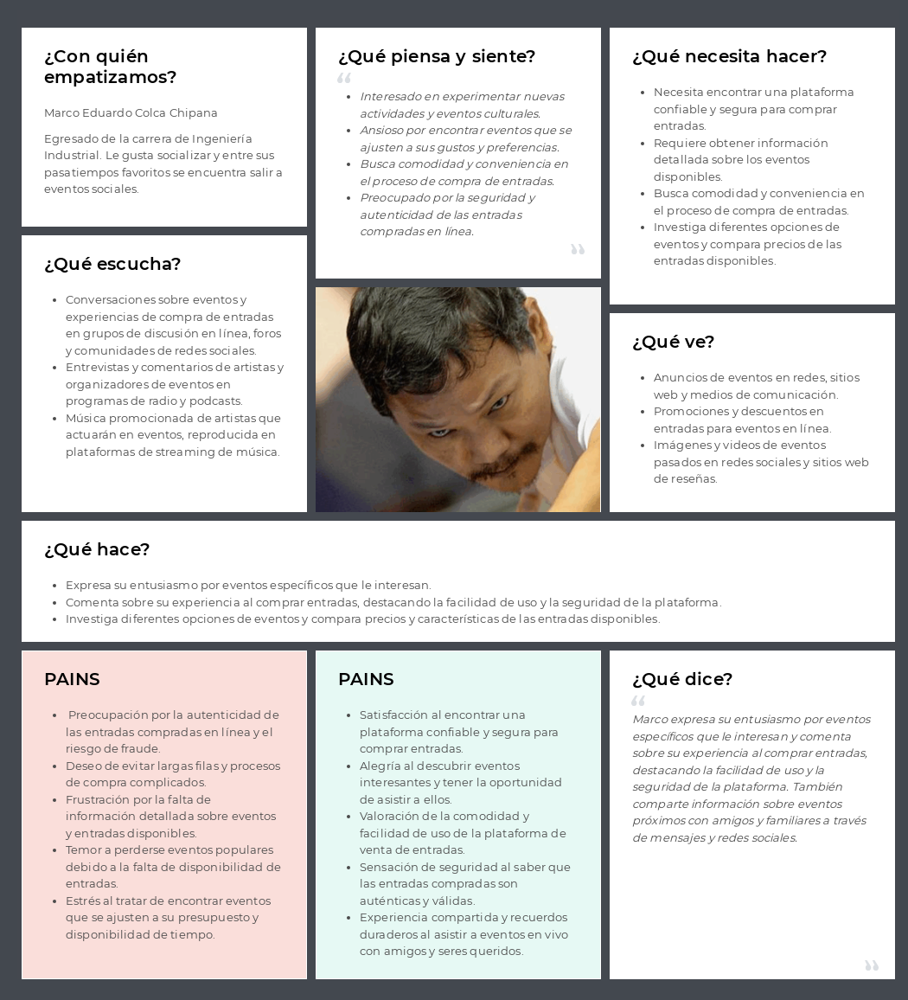
<h4>Empathy Map - Organizador de Eventos</h4>
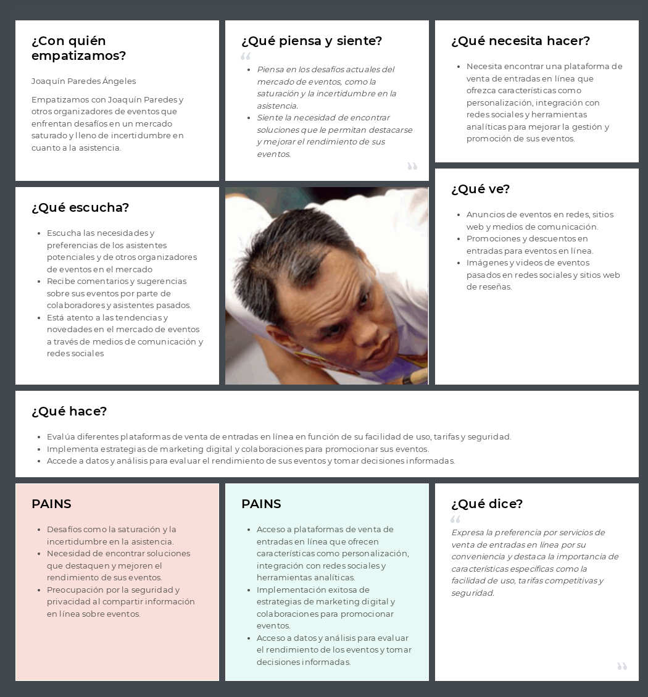

<h3>2.3.5 As-Is Scenario Mapping</h3>
<h4>As-Is - Organizador de Eventos</h4>

<h4>As-Is - Cliente</h4>

<h2>2.3 Ubiquitous Language</h2>

    
<h1>CAPÍTULO III: REQUIREMENTS SPECIFICATION</h1>
<h2>3.1 To-Be Scenario Mapping</h2>
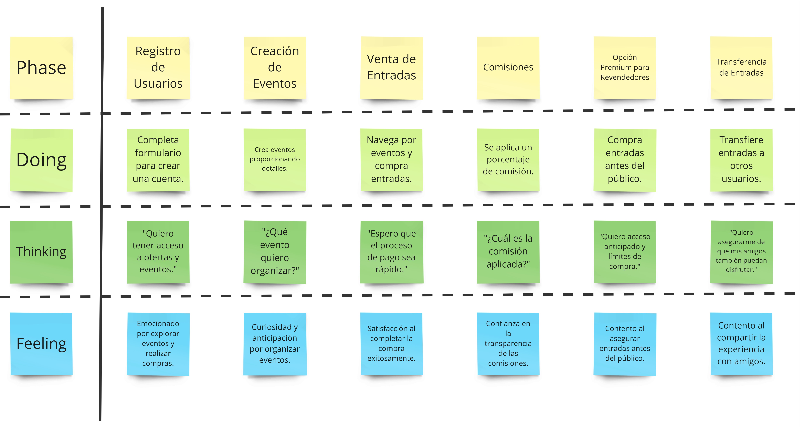
<h2>3.2 User Stories</h2>
<table>
  <thead>
    <tr>
      <th>Epic / Story ID</th>
      <th>Título</th>
      <th>Descripción</th>
      <th>Criterios de aceptación</th>
      <th>Relacionado con (Epic ID)</th>
    </tr>
  </thead>
  <tbody>
    <tr>
      <td>EP01</td>
      <td>Autenticación de usuario</td>
      <td>Como usuario Quiero registrarme e iniciar sesión Para acceder a la aplicación MyEvent</td>
      <td>El usuario puede registrar una cuenta nueva con su información personal.
          El usuario puede iniciar sesión con su nombre de usuario y contraseña.
          El usuario recibirá un mensaje de error si el inicio de sesión falla.</td>
      <td>EP01</td>
    </tr>
    <tr>
      <td>EP02</td>
      <td>Creación de eventos</td>
      <td>Como organizador de eventos Quiero poder crear y publicar eventos en la plataforma Para promover mi evento y vender entradas</td>
      <td>El organizador puede completar un formulario con detalles del evento.
          El organizador puede enviar el evento para su revisión y aprobación.
          El evento se muestra en la plataforma una vez aprobado por el administrador.</td>
      <td>EP02</td>
    </tr>
    <tr>
      <td>EP03</td>
      <td>Exploración de eventos</td>
      <td>Como usuario interesado en eventos Quiero poder buscar y filtrar eventos disponibles Para encontrar eventos que me interesen</td>
      <td>El usuario puede navegar por una lista de eventos.
          El usuario puede aplicar filtros por categorías como género musical, ubicación y fecha.
          El usuario puede ver detalles de eventos individuales haciendo clic en ellos.</td>
      <td>EP03</td>
    </tr>
    <tr>
      <td>EP04</td>
      <td>Compra de entradas</td>
      <td>Como comprador de entradas Quiero poder seleccionar y comprar entradas Para asegurar mi participación en eventos</td>
      <td>El usuario puede seleccionar las entradas deseadas y agregarlas al carrito.
          El usuario puede completar el proceso de pago utilizando diferentes métodos de pago.
          El usuario recibe confirmación de la compra por correo electrónico.</td>
      <td>EP04</td>
    </tr>
    <tr>
      <td>EP05</td>
      <td>Opción Premium para Revendedores</td>
      <td>Como revendedor Quiero tener una opción premium Para obtener ventajas sobre otros compradores</td>
      <td>El revendedor puede comprar una membresía premium con acceso anticipado y límites de compra más altos.
          El revendedor puede acceder a la opción premium desde su cuenta.
          El revendedor recibe beneficios adicionales al adquirir la membresía premium.</td>
      <td>EP05</td>
    </tr>
    <tr>
      <td>EP06</td>
      <td>Transferencia de Entradas</td>
      <td>Como usuario que ya ha comprado entradas Quiero poder transferirlas a otros usuarios Para permitir que otros disfruten del evento</td>
      <td>El usuario puede seleccionar las entradas que desea transferir.
          El usuario puede proporcionar la información de contacto del destinatario.
          El usuario recibe confirmación de la transferencia exitosa.</td>
      <td>EP06</td>
    </tr>
    <tr>
      <td>EP07</td>
      <td>Membresía de Descuentos Periódicos</td>
      <td>Como usuario fiel a la plataforma Quiero recibir descuentos especiales periódicamente Para incentivar mi participación continua</td>
      <td>El usuario puede adquirir una membresía que le otorgue descuentos periódicos en eventos seleccionados.
          El usuario recibe notificaciones sobre los descuentos disponibles.
          El usuario puede aplicar los descuentos durante el proceso de compra.</td>
      <td>EP07</td>
    </tr>
        <tr>
      <td>EP08</td>
      <td>Membresía de Concursos y Sorteos Exclusivos</td>
      <td>Como miembro de la plataforma, quiero participar en concursos y sorteos exclusivos para ganar entradas gratuitas y experiencias VIP, para disfrutar de beneficios adicionales y experiencias únicas.</td>
      <td>El usuario puede acceder a concursos y sorteos exclusivos desde su cuenta.
          El usuario puede participar en los concursos y sorteos siguiendo las instrucciones proporcionadas.
          El usuario recibe notificaciones sobre los resultados de los concursos y sorteos.</td>
      <td>EP08</td>
    </tr>
    <tr>
      <td>EP09</td>
      <td>Membresía de Contenido Exclusivo</td>
      <td>Como suscriptor premium, quiero tener acceso a contenido exclusivo relacionado con eventos, como transmisiones en vivo y entrevistas detrás de escena, para disfrutar de una experiencia más completa y enriquecedora.</td>
      <td>El usuario puede acceder a contenido exclusivo desde su cuenta premium.
          El usuario puede ver transmisiones en vivo y contenido especial disponible solo para suscriptores premium.
          El usuario puede comentar y compartir el contenido exclusivo con otros usuarios.</td>
      <td>EP09</td>
    </tr>
    <tr>
      <td>EP10</td>
      <td>Membresía de Prioridad en Servicio al Cliente</td>
      <td>Como usuario premium, quiero recibir atención prioritaria en el servicio al cliente, con tiempos de respuesta más rápidos y asistencia personalizada, para sentirme valorado y apoyado como cliente leal.  </td>
      <td>El usuario premium puede acceder a un servicio al cliente dedicado desde su cuenta.
          El usuario premium recibe respuestas más rápidas a sus consultas y solicitudes de soporte.
          El usuario premium puede comunicarse con el servicio al cliente a través de canales exclusivos, como líneas telefónicas o correos electrónicos dedicados.</td>
      <td>EP10</td>
<tr>
  <td>EP11</td>
  <td>Membresía de Descuentos en Futuras Compras</td>
  <td>Como usuario habitual de la plataforma, quiero recibir descuentos para futuras compras de entradas Para incentivar mi lealtad y continuar utilizando el servicio</td>
  <td>El usuario acumula descuentos después de comprar un número determinado de entradas.
      El usuario recibe un cupón de descuento para su próxima compra después de alcanzar el umbral establecido.
      El usuario puede aplicar el cupón durante el proceso de compra.</td>
  <td>EP11</td>
</tr>
<tr>
  <td>EP12</td>
  <td>Entradas Gratis para Eventos Seleccionados</td>
  <td>Como usuario frecuente de la plataforma, quiero tener la oportunidad de obtener entradas gratuitas Para disfrutar de eventos sin costo adicional y fomentar mi fidelidad</td>
  <td>El usuario acumula entradas gratuitas después de comprar un cierto número de entradas.
      El usuario puede canjear una entrada gratuita para un evento específico de su elección.
      El usuario puede seleccionar la entrada gratuita durante el proceso de compra.</td>
  <td>EP12</td>
</tr>
<tr>
  <td>EP13</td>
  <td>Acceso a Preventas Exclusivas</td>
  <td>Como usuario frecuente de la plataforma, quiero tener acceso exclusivo a preventas de eventos populares Para asegurar mi participación en eventos de alto demanda</td>
  <td>El usuario acumula acceso a preventas exclusivas después de comprar un número determinado de entradas.
      El usuario puede comprar entradas antes de que estén disponibles para el público en general.
      El usuario puede asegurar su participación en eventos populares durante la preventa.</td>
  <td>EP13</td>
</tr>
<tr>
  <td>EP14</td>
  <td>Puntos de Fidelidad o Programa de Recompensas</td>
  <td>Como usuario frecuente de la plataforma, quiero acumular puntos de fidelidad por cada compra de entradas Para canjearlos por descuentos, entradas gratuitas u otros beneficios</td>
  <td>El usuario acumula puntos de fidelidad por cada compra de entradas.
      El usuario puede canjear los puntos por recompensas como descuentos, entradas gratis o productos exclusivos.
      El usuario puede verificar su saldo de puntos y las opciones de canje desde su cuenta.</td>
  <td>EP14</td>
</tr>
<tr>
  <td>EP15</td>
  <td>Niveles de Entrada con Descuento</td>
  <td>Como usuario frecuente de la plataforma, quiero acceder a precios especiales de entrada después de realizar cierto número de compras Para disfrutar de beneficios adicionales y promociones exclusivas</td>
  <td>El usuario alcanza niveles de entrada con descuento después de comprar un número determinado de entradas.
      El usuario puede acceder a precios especiales para ciertos niveles de entrada.
      El usuario puede seleccionar el nivel de entrada con descuento durante el proceso de compra.</td>
  <td>EP15</td>
</tr>
<tr>
  <td>EP16</td>
  <td>Notificaciones de Eventos y Ofertas</td>
  <td>Como usuario de la plataforma, quiero recibir notificaciones sobre eventos nuevos y ofertas especiales Para estar al tanto de las últimas novedades y oportunidades</td>
  <td>El usuario puede optar por recibir notificaciones por correo electrónico o mensajes push en la aplicación.
      El usuario puede configurar sus preferencias de notificación desde la cuenta.
      El usuario recibe información actualizada sobre eventos nuevos, descuentos y promociones.</td>
  <td>EP16</td>
</tr>
<tr>
  <td>EP17</td>
  <td>Integración con Redes Sociales</td>
  <td>Como usuario de la plataforma, quiero poder compartir eventos y experiencias en mis redes sociales Para ampliar el alcance de la plataforma y compartir intereses con amigos</td>
  <td>El usuario puede conectar su cuenta de la plataforma con redes sociales como Facebook, Twitter o Instagram.
      El usuario puede compartir detalles de eventos, compras de entradas y experiencias directamente desde la plataforma.
      Los amigos y seguidores del usuario pueden ver y participar en eventos compartidos.</td>
  <td>EP17</td>
</tr>
<tr>
  <td>EP18</td>
  <td>Soporte Multilingüe</td>
  <td>Como usuario de la plataforma, quiero poder acceder a la aplicación en varios idiomas Para facilitar la navegación y comprensión del contenido</td>
  <td>El usuario puede seleccionar su idioma preferido desde la configuración de la cuenta.
      La aplicación se traduce automáticamente al idioma seleccionado por el usuario.
      Todos los textos, botones y mensajes de la aplicación están disponibles en el idioma elegido.</td>
  <td>EP18</td>
</tr>
<tr>
  <td>EP19</td>
  <td>Integración con Mapas y Direcciones</td>
  <td>Como usuario de la plataforma, quiero tener acceso a información de ubicación y direcciones de eventos Para facilitar la planificación y asistencia a los mismos</td>
  <td>El usuario puede ver la ubicación del evento en un mapa interactivo.
      El usuario puede obtener direcciones y rutas recomendadas hacia el lugar del evento.
      La aplicación muestra información detallada sobre la ubicación, incluyendo transporte público cercano y estacionamientos.</td>
  <td>EP19</td>
</tr>
<tr>
  <td>EP20</td>
  <td>Calificación y Reseñas de Eventos</td>
  <td>Como usuario de la plataforma, quiero poder calificar y dejar reseñas sobre eventos a los que asistí Para compartir experiencias y ayudar a otros usuarios en su decisión de compra</td>
  <td>El usuario puede calificar eventos utilizando una escala de estrellas.
      El usuario puede escribir reseñas detalladas sobre su experiencia en el evento.
      Las calificaciones y reseñas están visibles para otros usuarios interesados en el evento.</td>
  <td>EP20</td>
</tr>
<tr>
  <td>EP21</td>
  <td>Asistencia en Vivo y Chat en Línea</td>
  <td>Como usuario de la plataforma, quiero tener acceso a asistencia en vivo y chat en línea Para resolver consultas rápidamente y recibir ayuda durante la navegación</td>
  <td>El usuario puede acceder a un servicio de chat en vivo desde la aplicación.
      El usuario puede recibir respuestas rápidas a preguntas sobre eventos, compras de entradas y problemas técnicos.
      La asistencia en vivo está disponible durante horas específicas y es accesible desde cualquier página de la aplicación.</td>
  <td>EP21</td>
</tr>
<tr>
  <td>EP22</td>
  <td>Estadísticas y Análisis de Participación</td>
  <td>Como organizador de eventos, quiero acceder a estadísticas y análisis detallados sobre la participación en mis eventos Para evaluar su éxito y mejorar la planificación futura</td>
  <td>El organizador puede ver datos de participación, incluyendo número de entradas vendidas y perfiles de compradores.
      El organizador puede acceder a informes analíticos sobre la satisfacción de los asistentes y la efectividad de las estrategias de marketing.
      Las estadísticas están disponibles en tiempo real y se presentan de manera clara y comprensible.</td>
  <td>EP22</td>
</tr>
<tr>
  <td>EP23</td>
  <td>Integración con Plataformas de Streaming</td>
  <td>Como usuario de la plataforma, quiero tener acceso a transmisiones en vivo y contenido exclusivo de eventos Para disfrutar de experiencias virtuales y ampliar mi participación en eventos</td>
  <td>El usuario puede acceder a transmisiones en vivo de eventos a través de la plataforma.
      El usuario puede ver contenido exclusivo relacionado con eventos como entrevistas, sesiones acústicas y contenido detrás de escena.
      La plataforma integra servicios de streaming populares para ofrecer una experiencia inmersiva a los usuarios.</td>
  <td>EP23</td>
</tr>
<tr>
  <td>EP24</td>
  <td>Verificación de Identidad para Revendedores</td>
  <td>Como revendedor de entradas, quiero completar un proceso de verificación de identidad Para garantizar la legitimidad de mis transacciones y proteger la integridad de la plataforma</td>
  <td>El revendedor proporciona información de identificación oficial, como documento de identidad o pasaporte.
      La plataforma verifica la identidad del revendedor antes de habilitar funciones avanzadas como la compra anticipada y límites de compra más altos.
      La verificación de identidad se realiza de manera segura y confidencial, cumpliendo con las regulaciones de protección de datos.</td>
  <td>EP24</td>
</tr>
<tr>
  <td>EP25</td>
  <td>Integración con Plataformas de Pago Internacionales</td>
  <td>Como usuario internacional de la plataforma, quiero poder utilizar diferentes métodos de pago Para facilitar la compra de entradas desde cualquier parte del mundo</td>
  <td>El usuario puede seleccionar su método de pago preferido entre una variedad de opciones internacionales.
      La plataforma integra pasarelas de pago seguras y confiables que admiten tarjetas de crédito, transferencias bancarias y monederos electrónicos.
      Los pagos se procesan en la moneda local del usuario, simplificando las transacciones internacionales.</td>
  <td>EP25</td>
</tr>
<tr>
  <td>EP26</td>
  <td>Reserva de Entradas</td>
  <td>Como usuario de la plataforma, quiero tener la opción de reservar entradas para eventos populares Para garantizar mi participación antes de la venta general</td>
  <td>El usuario puede realizar una reserva para asegurar entradas antes de que estén disponibles para la venta general.
      La reserva se confirma mediante un pago inicial que se deduce del precio total de las entradas.
      El usuario recibe instrucciones claras sobre el proceso de reserva y los plazos de pago.</td>
  <td>EP26</td>
</tr>
<tr>
  <td>EP27</td>
  <td>Reembolso y Política de Devoluciones</td>
  <td>Como usuario de la plataforma, quiero conocer la política de reembolso y devoluciones Para tomar decisiones informadas sobre mis compras de entradas</td>
  <td>La plataforma proporciona información clara sobre las condiciones de reembolso y devoluciones.
      El usuario puede solicitar un reembolso dentro de ciertos plazos y bajo ciertas condiciones especificadas.
      La política de reembolso y devoluciones se comunica de manera transparente para garantizar la satisfacción del cliente.</td>
  <td>EP27</td>
</tr>

</tr>
  </tbody>
</table>

<h2>3.3 Impact Mapping</h2>
  

<h2>3.4 Product Backlog</h2>
<table>
  <thead>
    <tr>
      <th># Orden</th>
      <th>User Story ID</th>
      <th>Título</th>
      <th>Descripción</th>
      <th>Story Points</th>
    </tr>
  </thead>
  <tbody>
    <tr>
      <td>1</td>
      <td>EP01</td>
      <td>Autenticación de usuario</td>
      <td>Como usuario quiero registrarme e iniciar sesión Para acceder a MyEvent</td>
      <td>3</td>
    </tr>
    <tr>
      <td>2</td>
      <td>EP02</td>
      <td>Creación de eventos</td>
      <td>Como organizador de eventos Quiero poder crear y publicar eventos en la plataforma Para promover mi evento y vender entradas</td>
      <td>5</td>
    </tr>
    <tr>
      <td>3</td>
      <td>EP03</td>
      <td>Exploración de eventos</td>
      <td>Como usuario interesado en eventos Quiero poder buscar y filtrar eventos disponibles Para encontrar eventos que me interesen</td>
      <td>3</td>
    </tr>
    <tr>
      <td>4</td>
      <td>EP04</td>
      <td>Compra de entradas</td>
      <td>Como comprador de entradas Quiero poder seleccionar y comprar entradas Para asegurar mi participación en eventos</td>
      <td>8</td>
    </tr>
    <tr>
      <td>5</td>
      <td>EP05</td>
      <td>Opción Premium para Revendedores</td>
      <td>Como revendedor Quiero tener una opción premium Para obtener ventajas sobre otros compradores</td>
      <td>5</td>
    </tr>
    <tr>
      <td>6</td>
      <td>EP06</td>
      <td>Transferencia de Entradas</td>
      <td>Como usuario que ya ha comprado entradas Quiero poder transferirlas a otros usuarios Para permitir que otros disfruten del evento</td>
      <td>3</td>
    </tr>
    <tr>
      <td>7</td>
      <td>EP07</td>
      <td>Membresía de Descuentos Periódicos</td>
      <td>Como usuario fiel a la plataforma Quiero recibir descuentos especiales periódicamente Para incentivar mi participación continua</td>
      <td>2</td>
    </tr>
    <tr>
      <td>8</td>
      <td>EP08</td>
      <td>Membresía de Concursos y Sorteos Exclusivos</td>
      <td>Como miembro de la plataforma, quiero participar en concursos y sorteos exclusivos para ganar entradas gratuitas y experiencias VIP, para disfrutar de beneficios adicionales y experiencias únicas.</td>
      <td>3</td>
    </tr>
    <tr>
      <td>9</td>
      <td>EP09</td>
      <td>Membresía de Contenido Exclusivo</td>
      <td>Como suscriptor premium, quiero tener acceso a contenido exclusivo relacionado con eventos, como transmisiones en vivo y entrevistas detrás de escena, para disfrutar de una experiencia más completa y enriquecedora.</td>
      <td>5</td>
    </tr>
    <tr>
      <td>10</td>
      <td>EP10</td>
      <td>Membresía de Prioridad en Servicio al Cliente</td>
      <td>Como usuario premium, quiero recibir atención prioritaria en el servicio al cliente, con tiempos de respuesta más rápidos y asistencia personalizada, para sentirme valorado y apoyado como cliente leal.</td>
      <td>3</td>
    </tr>
  </tbody>
</table>

    
<h1>CAPÍTULO IV: PRODUCT UX/UI DESIGN</h1>
<h2>4.1 Style Guidelines</h2>
<h3>4.1.1 General Style Guidelines</h3>
<h3>4.1.2 Web Style Guidelines</h3>

<h2>4.2 Information Architecture</h2>
<h3>4.2.1 Organization Systems</h3>

En este apartado, nuestro equipo ha optado por implementar un enfoque basado en la jerarquía visual. Creemos firmemente que esta estructura organizativa proporcionará una experiencia más intuitiva y eficiente para nuestros usuarios, al tiempo que les permitirá interactuar de manera más fluida con nuestra aplicación.

<h3>4.2.2 Labeling Systems</h3>

Para el diseño de nuestra página web, hemos implementado un sistema de etiquetado uniforme con el objetivo de facilitar la navegación de los usuarios por nuestra plataforma. Este sistema se compone de etiquetas específicas que tienen funciones definidas para mejorar la experiencia del usuario. A continuación, se detallan las etiquetas utilizadas:

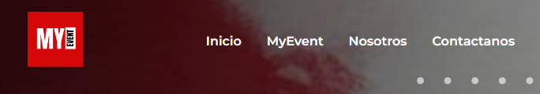
<ul>
  <li><strong>Inicio:</strong> Dirige a la página de inicio.</li>
  <li><strong>MyEvent:</strong> Acceso al área de eventos disponibles.</li>
  <li><strong>Nosotros:</strong> Información sobre nuestra empresa.</li>
  <li><strong>Contáctanos:</strong> Canal para comunicarse con nuestro equipo de soporte.</li>
</ul>
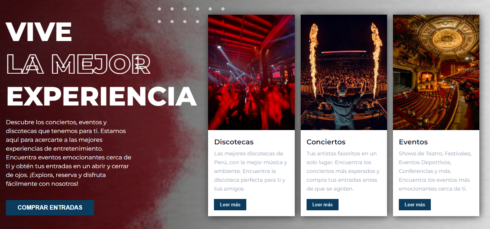
<ul>
  <li><strong>Discotecas:</strong> Eventos relacionados con establecimientos sociales y clubes.</li>
  <li><strong>Conciertos:</strong> Eventos musicales en vivo.</li>
  <li><strong>Eventos:</strong> Otras actividades y espectáculos disponibles.</li>
</ul>

<h3>4.2.3 SEO Tags and Meta Tags</h3>

Para mejorar la visibilidad y el posicionamiento de nuestro sitio web en los motores de búsqueda, implementamos una estrategia sólida de SEO (Search Engine Optimization) que incluye el uso adecuado de etiquetas SEO y meta etiquetas. Estas etiquetas desempeñan un papel crucial en la optimización del contenido para que sea más accesible y relevante para los motores de búsqueda, lo que a su vez aumenta la probabilidad de que nuestro sitio web aparezca en los resultados de búsqueda relevantes para nuestros usuarios.

    
<h3>Etiquetas SEO Principales Utilizadas:</h3>
    <ol>
        <li><strong>Title Tag (etiqueta de título):</strong> Cada página de nuestro sitio web cuenta con un título único y descriptivo que captura la esencia del contenido de esa página. Estos títulos están optimizados con palabras clave relevantes para mejorar su visibilidad en los resultados de búsqueda.</li>
        <li><strong>Meta Description Tag (etiqueta de descripción meta):</strong> Para complementar el título, cada página también incluye una meta descripción que proporciona un resumen conciso del contenido de la página. Estas descripciones están diseñadas para ser informativas y atractivas para los usuarios, lo que puede aumentar la tasa de clics en los resultados de búsqueda.</li>
        <li><strong>Meta Keywords Tag (etiqueta de palabras clave meta):</strong> Aunque el uso de meta palabras clave ha disminuido en importancia en los últimos años, aún las utilizamos de manera estratégica para identificar las palabras clave principales relacionadas con el contenido de la página. Esto ayuda a los motores de búsqueda a comprender mejor el tema y la relevancia del contenido.</li>
        <li><strong>Canonical Tag (etiqueta canónica):</strong> En casos donde tenemos múltiples URL que muestran el mismo contenido o contenido similar, utilizamos etiquetas canónicas para indicar a los motores de búsqueda la URL preferida que deben indexar y mostrar en los resultados de búsqueda.</li>
    </ol>
    
<h3>Otros Aspectos Relevantes:</h3>
    <ul>
        <li><strong>Etiquetas Alt en Imágenes:</strong> Cada imagen en nuestro sitio web incluye una etiqueta alt descriptiva que ayuda a los motores de búsqueda a comprender el contenido de la imagen. Esto también mejora la accesibilidad para usuarios con discapacidades visuales.</li>
        <li><strong>Etiquetas Heading (H1, H2, H3, etc.):</strong> Utilizamos etiquetas de encabezado de manera jerárquica para estructurar el contenido de nuestras páginas web. Esto no solo mejora la legibilidad y la experiencia del usuario, sino que también proporciona pistas adicionales a los motores de búsqueda sobre la relevancia y la organización del contenido.</li>
    </ul>
    

Nuestra estrategia de etiquetado SEO y meta tags está diseñada para garantizar que nuestro sitio web sea fácilmente indexado y clasificado por los motores de búsqueda, lo que aumenta su visibilidad y accesibilidad para nuestros usuarios objetivo.

<h3>4.2.4 Searching Systems</h3>

Los sistemas de búsqueda son esenciales para permitir a los usuarios encontrar y descubrir características y funcionalidades relevantes en nuestro sitio web. Para una experiencia de usuario eficiente, hemos implementado un sistema de búsqueda simple pero efectivo:

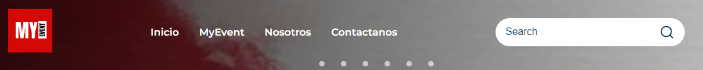
<ul>
  <li><strong>Lupa de Búsqueda:</strong> Permite a los usuarios buscar rápidamente cualquier tema de su interés.</li>
  <li><strong>Perfil de Usuario:</strong> Representado por el icono del usuario, proporciona acceso al perfil del usuario para editar información o iniciar sesión.</li>
  <li><strong>Membresías:</strong> Representado por el icono de membresías, muestra los planes disponibles y sus precios para suscripciones mensuales o anuales.</li>
</ul>

<h3>4.2.5 Navigation Systems</h3>

Nuestra aplicación cuenta con un sistema de navegación claro y definido para garantizar una experiencia fluida para los usuarios.

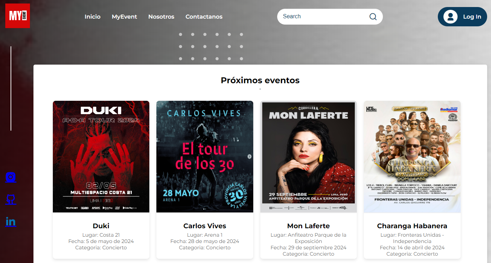

El sistema de navegación de nuestra aplicación móvil está diseñado para ofrecer a los usuarios una experiencia intuitiva y fluida. Con iconos claramente identificados en la parte superior, los usuarios pueden acceder fácilmente a las funciones principales de la aplicación.

<h2>4.3 Landing Page UI Design</h2>

<h3>4.3.1 Landing Page Wireframe</h3>
 
<td>Pantalla de inicio, contiene el apartado mas llamativo del landing page.</td>
 
<td>Desktop Web Browser:</td>
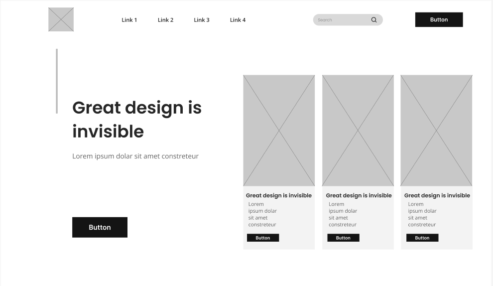
<td>Mobile Web Browser:</td>
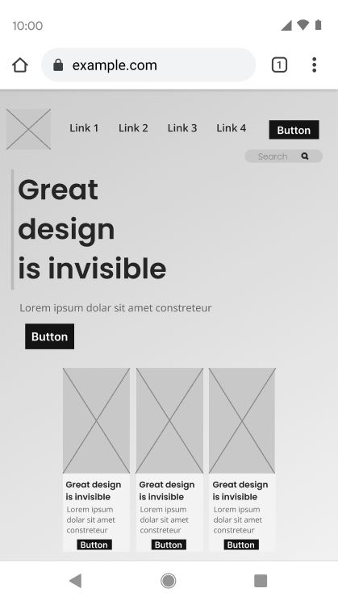
 
<td>Pantalla de "Proximos eventos", este apartado contiene los diversos eventos a los que pueden asistir los usuarios.</td>
 
<td>Desktop Web Browser:</td>
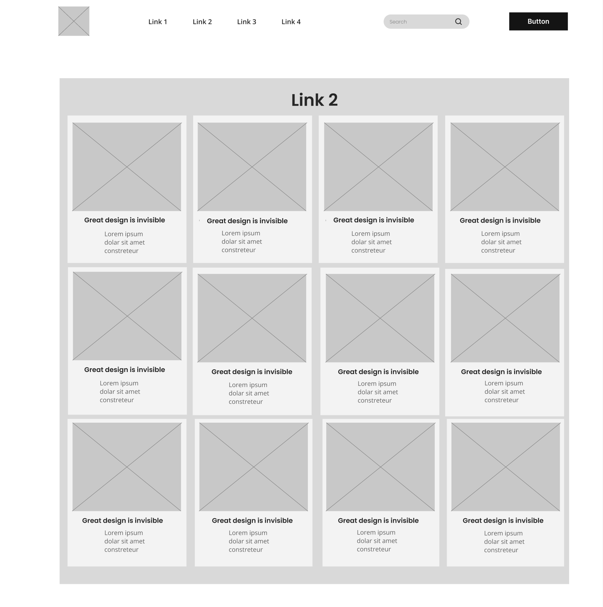
<td>Mobile Web Browser:</td>
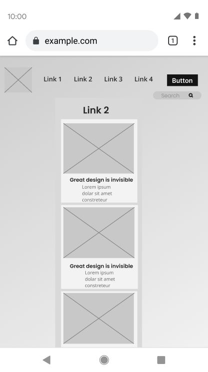
 
<td>Pantalla de "Nosotros", este apartado contiene la mision de la startup, junto con el proposito de la plataforma web.</td>
 <td>Desktop Web Browser:</td>
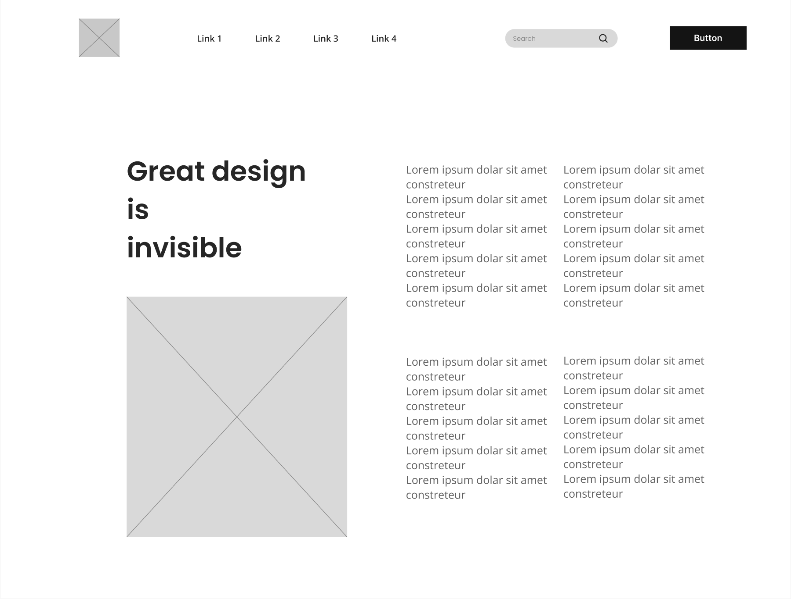
<td>Mobile Web Browser:</td>
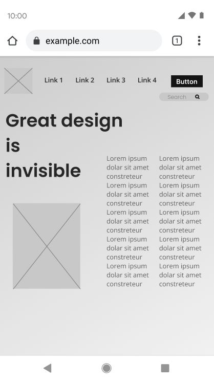
 
<td>Pantalla de "Contactanos", en este apartado encuentran la informacion de contacto del startup.</td>
 <td>Desktop Web Browser:</td>
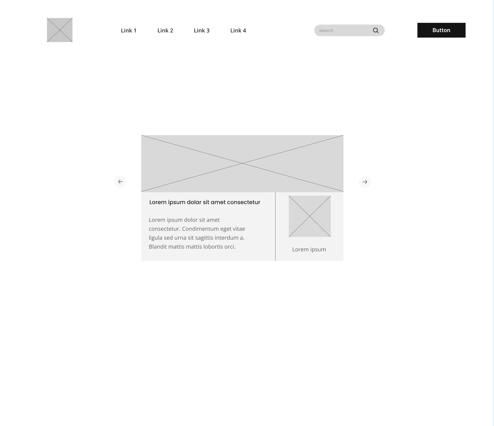
<td>Mobile Web Browser:</td>
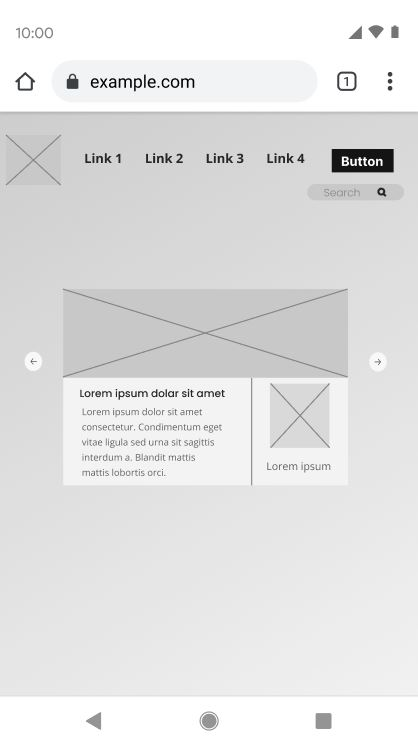
 

Link del Figma Desktop Web Browser : https://www.figma.com/file/dDsv9BCQHxxzDUz3hqTTyp/Landing-Page-Wireframe--Desarrollo-Open-Source?type=design&mode=design&t=baNvdMOlwkRcVvBE-1

Link del Figma Mobile Web Browser : https://www.figma.com/file/3uZbQ58V4KBA7Yexsds130/Mobile-Browser-Frames?type=design&node-id=2%3A1523&mode=design&t=LddOPqpidUhOV053-1

<h3>4.3.2 Landing Page Mock-up</h3>
 
<td>Pantalla de inicio, contiene el apartado mas llamativo del landing page con los colores asignados en el Style Guidelines, detalla brevemente las multiples opciones que puede tener el usuario, acompañado con imagenes referentes.</td>
 <td>Desktop Web Browser:</td>

<td>Mobile Web Browser:</td>
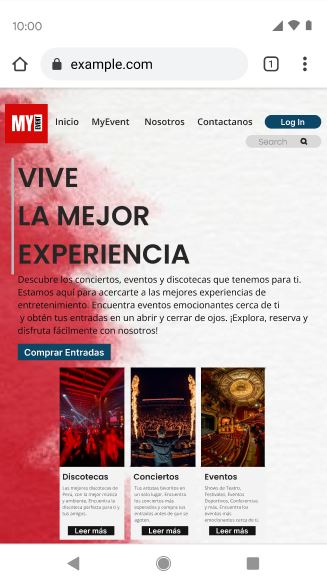
 
<td>Pantalla de "Proximos eventos", este apartado contiene los diversos eventos a los que el usuario puede asistir, incluye la foto del artista o artistas, el lugar y la fecha de preentación.</td>
 <td>Desktop Web Browser:</td>

<td>Mobile Web Browser:</td>
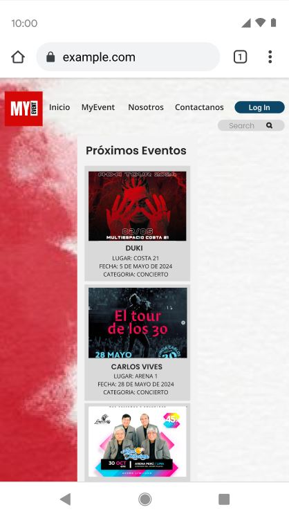
 
<td>Pantalla de "Nosotros", este apartado contiene la mision de la startup y muestra el lineamiento que sigue la paltaforma web para cunmplir su proposito.</td>
 <td>Desktop Web Browser:</td>

<td>Mobile Web Browser:</td>
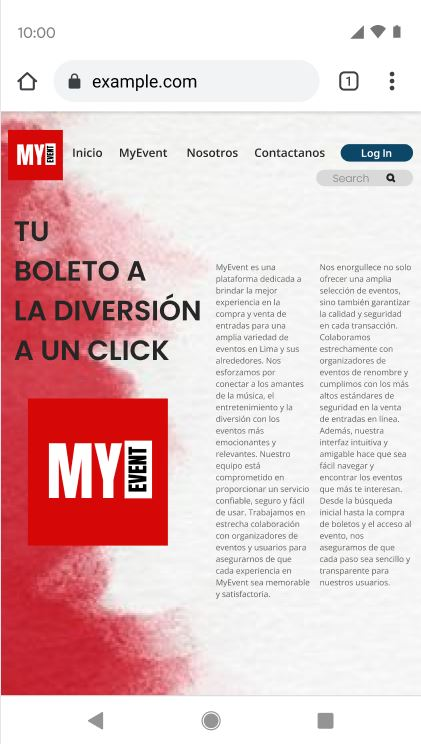
 
<td>Pantalla de "Contactanos", en este apartado encuentran la informacion de contacto del startup. Insertamos un QR Code para facilitar el medio de comunicacion entre el usuario y nosotros. </td>
 <td>Desktop Web Browser:</td>

<td>Mobile Web Browser:</td>

 
<h2>4.4 Web Applications UX/UI Design</h2>
<h3>4.4.1 Web Applications Wireframes</h3>
<h3>4.4.2 Web Applications Wireflow Diagrams</h3>
<h3>4.4.2 Web Applications Mock-ups</h3>
<h3>4.4.3 Web Applications User Flow Diagrams</h3>

<h2>4.5 Web Applications Prototyping</h2>

<h2>4.6 Domain-Driven Software Architecture</h2>
<h3>4.6.1 Software Architecture Context Diagram</h3>
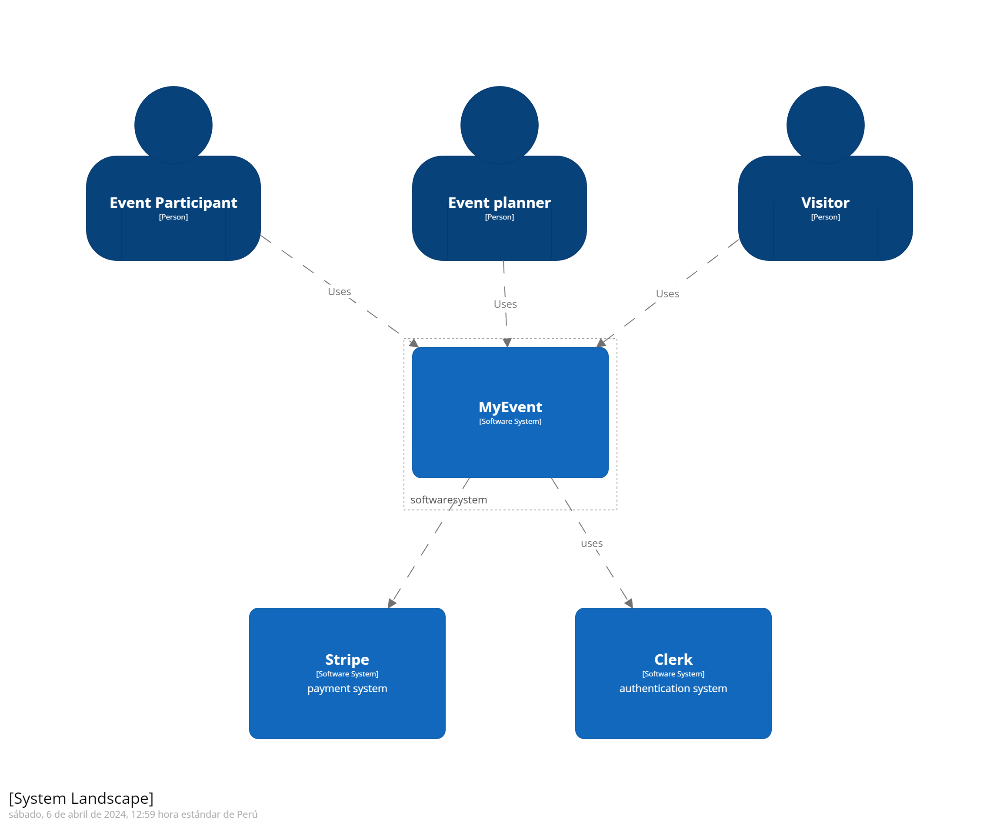
<h3>4.6.2 Software Architecture Container Diagrams</h3>
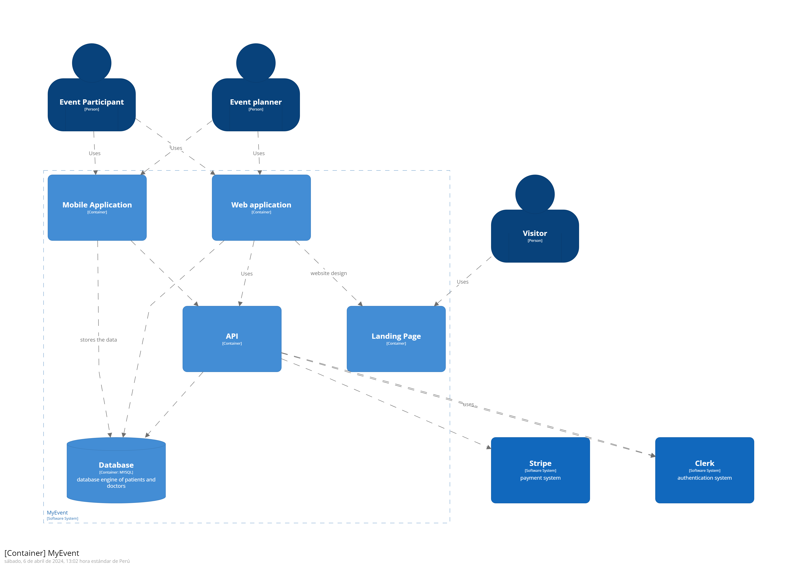
<h3>4.6.3 Software Architecture Components Diagrams</h3>
<h4>Landing Page</h4>
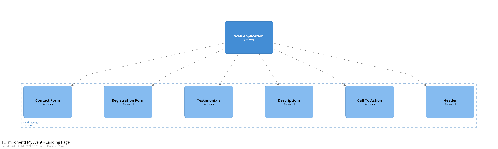
<h4>Web Application</h4>
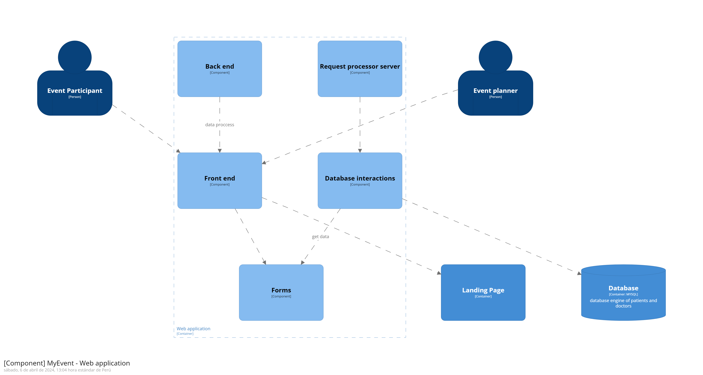
<h4>Mobile Application</h4>
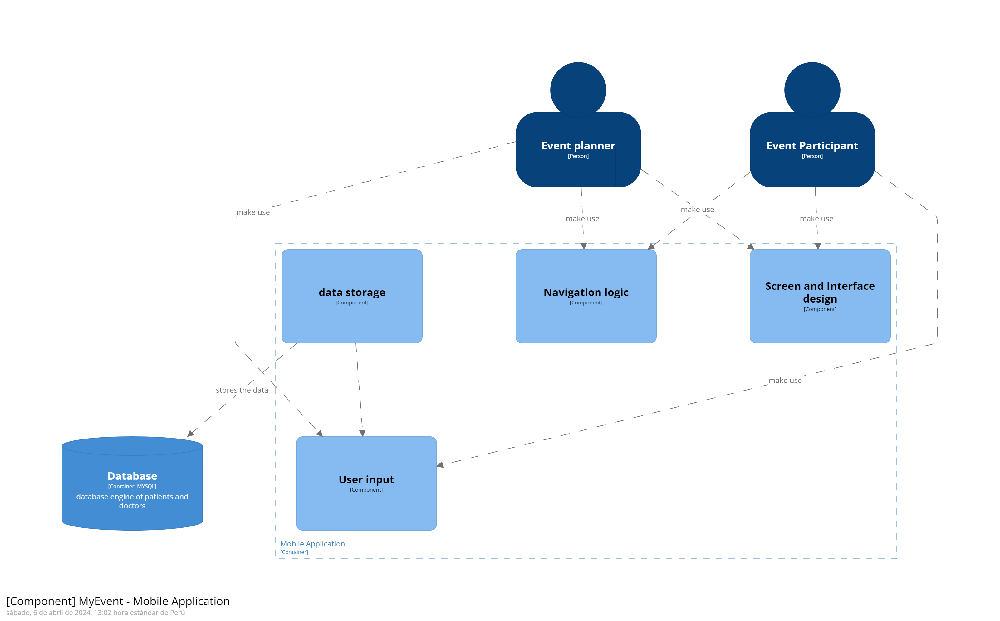
<h4>API</h4>
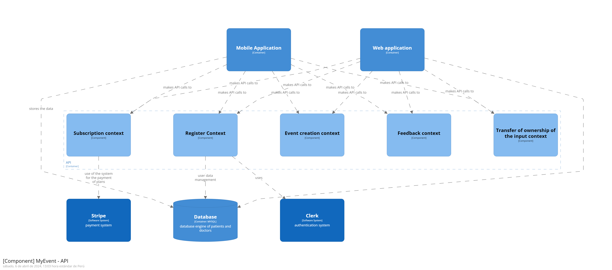

<h2>4.7 Software Object-Oriented Design</h2>
<h3>4.7.1 Class Diagrams</h3>
<h3>4.7.2 Class Dictionary</h3>

<h2>4.8 Database Design</h2>
<h3>4.8.1 Database Diagram</h3>

    
<h1>CAPÍTULO V: PRODUCT IMPLEMENTATION</h1>
<h2>5.1 Software Configuration Management</h2>
<h3>5.1.1 Software Development Environment Configuration</h3>
<h3>5.1.2 Source Code Management</h3>
<h3>5.1.3 Source Code Style Guide & Conventions</h3>
<h3>5.1.4 Software Deployment Configuration</h3>
    
<h2>5.2 Product Implementation & Deployment</h2>
<h3>5.2.1.1 Sprint Backlog 1</h3>
<h3>5.2.1.2 User Interface & Execution</h3>
<h3>5.2.1.3 Team Collaboration Insights</h3>
